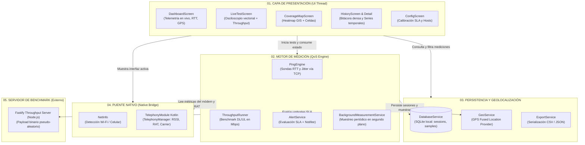

# TP5 - Network QoS Monitor

**Licenciatura en Sistemas de Información**  
**Desarrollo de Aplicaciones Móviles - 2026**

Analizador y visualizador de calidad de red móvil en tiempo real con mapeo de cobertura personal, persistencia local georreferenciada y diseño de instrumentación industrial brutalista (NOC Console).

---

## 01. Arquitectura de la Solución

El proyecto implementa una arquitectura desacoplada en capas para garantizar que los sockets de medición y temporizadores no degraden el hilo de JavaScript (UI Thread):



---

## 02. Estructura del Repositorio

- **`mobile/`**: Aplicación React Native CLI (TypeScript) con el módulo nativo Kotlin para Android y componentes de instrumentación.
- **`backend/`**: Servidor de referencia de alta velocidad en Node.js + Fastify para los tests de throughput de subida y descarga (RF-03).

---

## 03. Decisiones de Diseño y Limitaciones Técnicas Conocidas

1. **Sondas TCP vs. ICMP Raw Sockets**:
   - En Android e iOS estándar (sin permisos de root/jailbreak), el sistema operativo restringe la creación de sockets `SOCK_RAW` necesarios para ICMP ping tradicional.
   - Siguiendo la especificación del PRD (RF-02 y Sec 04.1), se implementaron sondas sobre sockets TCP reales (`react-native-tcp-socket`) midiendo con precisión el tiempo de establecimiento del handshake SYN/ACK contra puertos estándar (ej. 80, 53, 443).
2. **Filtrado de Métricas RF Inviables en Móviles**:
   - El prototipo inicial de laboratorio NOC incluía telemetría de analizador de espectro de escritorio (MIMO 4x4, orden de modulación QAM-256, captura promiscua PCAP `wlan0.mon0`, agregación de portadoras baseband).
   - Dado que las APIs públicas de Android (`TelephonyManager`) y de iOS (`CoreTelephony`) no exponen estos registros internos de bajo nivel sin firmware de depuración de fabricante, se concentró la telemetría en los datos fehacientes: Tipo de RAT móvil (5G NR, 4G LTE, 3G HSPA, WiFi), Operador, PLMN y Potencia de señal RSRP/RSSI en dBm.
3. **Cálculo de Jitter y SLA**:
   - El cálculo de jitter implementa la metodología estándar de RFC 2544 / RFC 3550 basada en la media de las desviaciones absolutas entre muestras consecutivas de RTT:  
     $$\text{Jitter} = \frac{\sum_{i=2}^{N} |RTT_i - RTT_{i-1}|}{N - 1}$$
4. **Protección de Datos No Comprimibles**:
   - El endpoint `/download` del backend de referencia transmite un buffer binario pseudo-aleatorio para evitar que la compresión transparente de la pila de red (ej. gzip) falsee el cálculo de throughput en Mbps.

---

## 04. Guía de Ejecución

### 4.1 Levantar el Backend de Referencia (Throughput Server)

```bash
cd backend
npm install
npm run build
npm start
```
*El servidor escuchará en `http://localhost:3000` (o `http://10.0.2.2:3000` accesible desde el emulador de Android).*

También disponible vía Docker:
```bash
docker build -t qos-benchmark-backend backend/
docker run -p 3000:3000 qos-benchmark-backend
```

### 4.2 Ejecutar la Aplicación Mobile (Android)

```bash
cd mobile
npm install
npx react-native run-android
```

### 4.3 Ejecutar Suite de Tests Automatizados

#### A. Tests Unitarios Mobile (Jest)
```bash
cd mobile
npm test
```
*Ejecuta 31 pruebas unitarias: cálculo de jitter RFC 2544, evaluación de umbrales SLA, ThroughputRunner, SQLite DatabaseService, GeodeticUtils y exportación RFC 4180 CSV/JSON.*

#### B. Tests Instrumentados Android (JUnit & Espresso en AVD/Dispositivo)
```bash
cd mobile/android
./gradlew connectedDebugAndroidTest
```
*Ejecuta las pruebas instrumentadas en el emulador Android (`QoSInstrumentationTest`), validando el ciclo de vida de `MainActivity`, arranque de contexto y servicios nativos.*

#### C. Tests de Integración Backend (Fastify & Node Test Runner)
```bash
cd backend
npm test
```
*Valida las respuestas de `/ping`, `/download` con control de payload dinámico y `/upload` con cálculo de tasa de transferencia.*
