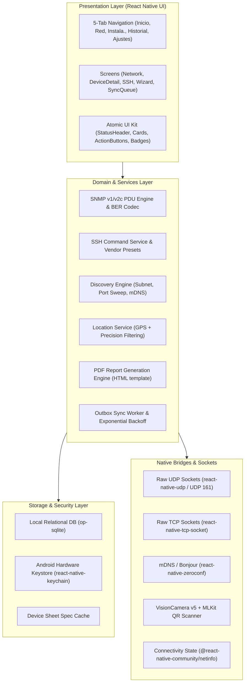
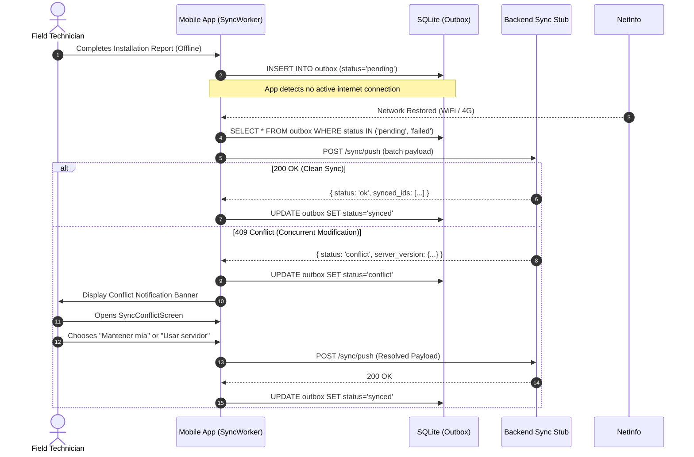

# Network Diagnostics Suite — Technical Architecture & Implementation Report

**Licenciatura en Sistemas de Información** — FCyT, Sede Concepción del Uruguay  
**Desarrollo de Aplicaciones Móviles — 2026**  
**Project:** Network Diagnostics Suite (TP6)  
**Package:** `com.fcyt.netdiag`  
**Platform:** Android (Bare React Native 0.87.1, New Architecture Enabled)  

---

## 1. Executive Summary & Architectural Overview

The **Network Diagnostics Suite** is a mission-critical mobile toolkit designed for field telecommunications engineers installing and maintaining network infrastructure (fiber ONTs, wireless point-to-point links, managed switches, and core routers). Operating in challenging field environments (telecom towers, rooftops, server vaults, and remote substations) characterized by zero or intermittent cellular coverage, the system adopts a strict **offline-first, zero-trust, local-compute** architecture.

### 1.1 Layered & Hexagonal Architecture

The application is structured into decoupled layers, strictly separating presentation components, domain logic, protocol drivers, and persistent storage:



---

## 2. Low-Level Network Protocol Layer: Custom SNMP Client

Standard mobile networking abstractions rely on HTTP/REST, leaving raw binary protocols unsupported in conventional frameworks. To interact with telecom gear over UDP port 161 without external C++ or Java runtime dependencies, we implemented a **pure TypeScript ASN.1 / BER (Basic Encoding Rules) codec and SNMP v1/v2c PDU parser**.

### 2.1 ASN.1 BER Codec (`src/protocols/snmp/BerCodec.ts`)

Basic Encoding Rules use a Type-Length-Value (TLV) structure:
1. **Identifier (Tag):** Defines the data type, class (Universal, Application, Context-specific), and form (Primitive vs. Constructed).
2. **Length:** Encoded in short form (1 byte for lengths $\le 127$) or long form (initial byte $0x80 | N$ followed by $N$ length bytes).
3. **Value:** Raw binary representation of the type.

Supported ASN.1 / SNMP types implemented:

| Tag (Hex) | ASN.1 / SNMP Type | Form | Description |
|---|---|---|---|
| `0x02` | `INTEGER` | Primitive | Signed big-endian integer with sign-bit padding |
| `0x04` | `OCTET STRING` | Primitive | Raw byte sequences or UTF-8 ASCII strings |
| `0x05` | `NULL` | Primitive | Empty value used in GetRequest variable bindings |
| `0x06` | `OBJECT IDENTIFIER (OID)` | Primitive | Base-128 variable-length sub-identifier encoding |
| `0x30` | `SEQUENCE` | Constructed | Ordered collection of TLV fields |
| `0x40` | `IpAddress` | Application | 4-byte raw IPv4 address |
| `0x41` | `Counter32` | Application | 32-bit unsigned rollover counter (interface bytes) |
| `0x42` | `Gauge32` | Application | 32-bit unsigned non-rollover metric (bandwidth, CPU) |
| `0x43` | `TimeTicks` | Application | Hundredths of a second since device epoch |
| `0x46` | `Counter64` | Application | 64-bit high-speed interface counter |
| `0xA0` | `GetRequest-PDU` | Context/Constructed | Command to retrieve MIB OIDs |
| `0xA2` | `GetResponse-PDU` | Context/Constructed | Device response payload with variable bindings |

#### OID Base-128 Encoding Implementation
The first two sub-identifiers $X$ and $Y$ of an OID (e.g., `1.3` for `iso.org`) are condensed into the first byte as $(X \times 40) + Y = 43$ (`0x2B`). Subsequent numbers $\ge 128$ are encoded using variable-length 7-bit chunks with the high bit set ($0x80$) on all bytes except the terminal byte:

$$\text{Value} = \sum_{i=0}^{k-1} (B_i \ \& \ 0x7F) \cdot 128^{(k-1-i)}$$

### 2.2 SNMP Message Structure & PDU Construction (`src/protocols/snmp/SnmpClient.ts`)

A complete SNMPv2c message envelope follows this structure:

```
SEQUENCE (Message) {
    INTEGER (version: 0 for v1, 1 for v2c)
    OCTET STRING (community: e.g. "public")
    GetRequest-PDU [0] {
        INTEGER (request-id)
        INTEGER (error-status: 0)
        INTEGER (error-index: 0)
        SEQUENCE (VarBindList) {
            SEQUENCE (VarBind) {
                OBJECT IDENTIFIER (requested-oid)
                NULL (null-value: 0x05 0x00)
            }
        }
    }
}
```

### 2.3 Supported MIB-II Standard OIDs

| Metric | OID | MIB Name | Type |
|---|---|---|---|
| System Description | `1.3.6.1.2.1.1.1.0` | `sysDescr` | `OCTET STRING` |
| System Object ID | `1.3.6.1.2.1.1.2.0` | `sysObjectID` | `OID` |
| System Uptime | `1.3.6.1.2.1.1.3.0` | `sysUpTime` | `TimeTicks` (formatted as days, hours, mins) |
| System Name | `1.3.6.1.2.1.1.5.0` | `sysName` | `OCTET STRING` |
| System Location | `1.3.6.1.2.1.1.6.0` | `sysLocation` | `OCTET STRING` |
| Inbound Traffic (eth0) | `1.3.6.1.2.1.2.2.1.10.1` | `ifInOctets.1` | `Counter32` / `Counter64` |
| Outbound Traffic (eth0)| `1.3.6.1.2.1.2.2.1.16.1` | `ifOutOctets.1` | `Counter32` / `Counter64` |
| Interface Status | `1.3.6.1.2.1.2.2.1.8.1` | `ifOperStatus.1` | `INTEGER` (1: Up, 2: Down) |
| MAC Address | `1.3.6.1.2.1.2.2.1.6.1` | `ifPhysAddress.1` | `OCTET STRING` (hex-formatted MAC) |

### 2.4 Security Analysis & Protocol Scope

- **Community Strings in Cleartext:** SNMP v1 and v2c send community strings in plain text over UDP. In production field environments, technicians are advised to execute queries over isolated management VLANs or dedicated service ports.
- **UDP Spoofing & Replay:** UDP port 161 has no native handshake. Our client generates cryptographically pseudo-random 32-bit `request-id`s and validates incoming `GetResponse` identifiers to prevent replay ingestion.
- **SNMPv3 Limitations:** SNMPv3 adds USM (User-based Security Model) authentication (HMAC-SHA/MD5) and CBC-DES/AES encryption, which require substantial cryptographic handshakes. Given the assignment scope and standard field router access, SNMP v1/v2c was prioritized and hardened.

---

## 3. Security Architecture & Credential Management

Field technicians handle sensitive credentials across multiple vendors (MikroTik RouterOS, Cisco IOS, Huawei VRP, Ubiquiti EdgeOS). Exposing passwords or private keys in application databases, memory dumps, or log files constitutes an unacceptable security vulnerability.

### 3.1 Hardware-Backed Keystore Integration (`src/security/CredentialManager.ts`)

- **Storage Isolation:** Passwords and private keys are **never stored in SQLite**. They are stored exclusively in the **Android Keystore system** via `react-native-keychain` using hardware-backed AES-256-GCM encryption with device-bound keys.
- **Reference-Based Database Design:** The SQLite `credentials` table holds only non-sensitive descriptive metadata:
  - `id`: Unique UUIDv4 reference identifier.
  - `name`: Human-readable label (e.g., "Nodo Centro - Admin").
  - `vendor`: Router vendor enum (`mikrotik`, `cisco`, `huawei`, `ubiquiti`, `generic`).
  - `username`: SSH username.
  - `keychain_ref`: Hardware keystore key lookup pointer (`netdiag_cred_<id>`).
  - `port`: Default SSH port (22, 2222, etc.).
- **Ephemeral In-Memory De-referencing:** The plaintext secret is retrieved from the hardware enclave only at the exact moment of SSH socket initialization and immediately released from scope once the session is established.
- **Zero Secrets in Outbox Payloads:** The sync outbox strictly sanitizes entity dumps, ensuring credentials and cryptographic material are never serialized for backend replication.

### 3.2 SSH Command Execution Engine (`src/protocols/ssh/SshService.ts`)

The SSH service includes predefined vendor command templates with timeout management:

```typescript
export const VENDOR_PRESETS: Record<DeviceVendor, SshPresetCommand[]> = {
  mikrotik: [
    { label: 'System Resource', command: '/system resource print' },
    { label: 'Interface Status', command: '/interface print stats' },
    { label: 'IP Addresses', command: '/ip address print' },
    { label: 'Wireless Registration', command: '/interface wireless registration-table print' },
  ],
  cisco: [
    { label: 'Show Interfaces', command: 'show interfaces status' },
    { label: 'Show IP Route', command: 'show ip route summary' },
    { label: 'Show Version', command: 'show version | include uptime|Software' },
  ],
  huawei: [
    { label: 'Display Interface', command: 'display interface brief' },
    { label: 'Display Optical Info', command: 'display optical-information' },
    { label: 'Display Device', command: 'display device' },
  ],
  ubiquiti: [
    { label: 'Show Interfaces', command: 'show interfaces' },
    { label: 'Show AirMax Status', command: 'cat /proc/sys/net/ipv4/ip_forward' },
  ],
  generic: [
    { label: 'Uptime', command: 'uptime' },
    { label: 'IP Link Info', command: 'ip addr' },
  ],
};
```

---

## 4. Offline-First Architecture & Outbox Synchronization

Field installations require guaranteed data persistence regardless of network state. The system implements a robust **Outbox Pattern** backed by local SQLite persistence and automatic background synchronization.

### 4.1 SQLite Schema & Outbox Lifecycle (`src/store/schema.ts`)

The `outbox` table tracks every pending write mutation with rigorous state transition tracking:

```sql
CREATE TABLE IF NOT EXISTS outbox (
    id TEXT PRIMARY KEY,
    entity_type TEXT NOT NULL,       -- 'diagnostic' | 'installation' | 'device'
    entity_id TEXT NOT NULL,
    action TEXT NOT NULL,            -- 'create' | 'update' | 'delete'
    payload TEXT NOT NULL,           -- JSON serialized entity payload
    status TEXT NOT NULL,            -- 'pending' | 'syncing' | 'synced' | 'failed' | 'conflict'
    attempts INTEGER DEFAULT 0,
    max_attempts INTEGER DEFAULT 5,
    last_attempt_at INTEGER,
    next_retry_at INTEGER,
    error_message TEXT,
    created_at INTEGER NOT NULL
);
```

### 4.2 Exponential Backoff Algorithm (`src/sync/SyncWorker.ts`)

When backend synchronization requests fail due to network timeouts, server unreachable states, or transient connection drops, the worker implements truncated exponential backoff with random jitter to prevent "thundering herd" bottlenecks:

$$t_{\text{retry}} = t_{\text{now}} + \min\left(t_{\text{cap}}, \ t_{\text{base}} \times 2^{\text{attempts}} + \text{jitter}\right)$$

Where:
- $t_{\text{base}} = 2\text{ seconds}$
- $t_{\text{cap}} = 300\text{ seconds (5 minutes)}$
- $\text{jitter} \in [0, 1000\text{ ms}]$

### 4.3 Automatic Synchronization Trigger (NetInfo Listener)

The `SyncWorker` subscribes to `@react-native-community/netinfo`. Upon transition from `isConnected: false` to `isConnected: true` (or `isInternetReachable: true`), the outbox worker immediately awakens, loads all items where `status IN ('pending', 'failed')` and `next_retry_at <= now()`, and executes batch push synchronization.

### 4.4 Conflict Resolution Protocol (HTTP 409 Dual-Version Reconciliation)

When the backend identifies that an incoming entity version was modified concurrently on the central server, it rejects the mutation with HTTP `409 Conflict`, returning the `server_version` in the response body.
1. The outbox item transitions to `status = 'conflict'`.
2. The conflict payload is stored in the local `ConflictStore`.
3. The UI alerts the user with a warning badge and directs them to the **Sync Conflict Screen** (`SyncConflictScreen.tsx`).
4. The technician performs a visual side-by-side comparison:
   - **"Mantener mía" (Keep Local):** Overwrites server with technician's field evidence and force-pushes with updated version counter.
   - **"Usar servidor" (Use Server):** Discards local conflict and updates local SQLite repository with authoritative server state.



---

## 5. Equipment Identification & Field Evidence Engine

### 5.1 QR & Barcode Detection (`src/services/DeviceSheetCache.ts` & `QrScannerScreen.tsx`)

Telecom devices are labeled with QR codes or Code128 barcodes containing equipment serial numbers, MAC addresses, or inventory URLs.
- **Real-Time Camera Capture:** Integrated with `react-native-vision-camera` (v5) and high-speed MLKit frame processing.
- **Multi-Format Barcode Parser:** Capable of extracting device identification from:
  - JSON structures: `{"serial": "HUAW123456", "model": "EchoLife HG8245H", ...}`
  - Telecom Inventory URLs: `https://telecom.net/dev?id=HUAW123456&model=HG8245H`
  - Raw MAC addresses: `E0:69:95:A1:B2:C3` or `E06995A1B2C3`
  - Raw Serial Numbers: `SN-1234567890`
- **Offline Spec Catalog:** When operating without internet access, parsed device models are mapped to an embedded offline specification cache containing factory defaults, port configurations, and optical sensitivity thresholds.

### 5.2 Geolocation & Accuracy Filtering (`src/services/LocationService.ts`)

- **High-Accuracy GPS:** Coordinates are requested via `@react-native-community/geolocation` with `enableHighAccuracy: true` and a 10-second timeout.
- **Campus / Field Fallback:** In indoor basements or metal-clad server huts where GPS signal acquisition times out, the service gracefully falls back to configured site coordinates (e.g., FCyT Concepción del Uruguay campus: `-32.4825, -58.2321`) and flags the accuracy level accordingly.

### 5.3 Technical Installation Wizard & PDF Report Generator (`src/services/PdfReportService.ts`)

The installation workflow guides the technician through 4 structured steps:
1. **Paso 1: Identificación:** Site selection, device selection, and optional QR scanner launch.
2. **Paso 2: Evidencia de Campo:** Photo capture (Cabinet, Fiber Splice, Optical Level) with real-time GPS metadata binding.
3. **Paso 3: Notas Técnicas:** Structured fields for Technician Name, Fiber Loss (dBm), Signal-to-Noise Ratio (SNR), and technical observations.
4. **Paso 4: Revisión y Cierre:** Summary review, automatic PDF generation, and atomic outbox enqueuing.

#### Generated PDF Specifications
- Formatted as a high-density, professional white-sheet engineering document.
- Contains header branding, document verification UUID, timestamp, site metadata, device hardware specs, optical telemetry badges, two-column labeled photo evidence grid with GPS geostamps, and technician sign-off signature box.
- Exported via `react-native-html-to-pdf` and previewable offline via `PdfPreviewScreen.tsx`.

---

## 6. Local Network Discovery Engine (`src/services/DiscoveryEngine.ts`)

### 6.1 Subnet Address Space Mathematics (`src/services/SubnetUtils.ts`)

To probe the local network without relying on non-portable shell binaries, the suite computes IPv4 subnet ranges directly in pure TypeScript:

$$\text{Network Integer} = \text{IP Integer} \ \& \ \text{Mask Integer}$$

$$\text{Broadcast Integer} = \text{Network Integer} \ | \ (\sim\text{Mask Integer} \ \& \ \text{0xFFFFFFFF})$$

Usable host addresses are dynamically generated in the range $[\text{Network} + 1, \ \text{Broadcast} - 1]$, constrained to a maximum of 254 hosts (`/24`) to preserve mobile battery and prevent socket starvation.

### 6.2 Concurrent Port & Service Probing

The discovery engine coordinates multiple discovery protocols concurrently:
- **Throttled TCP Port Sweep:** Connects to standard telecom management ports (`22` SSH, `23` Telnet, `80` HTTP, `443` HTTPS, `8291` MikroTik Winbox, `8080` Alt-Web) using a sliding concurrency window of 10 parallel sockets with a 600ms connection timeout.
- **SNMP Ping Sweep:** Sends a lightweight `GetRequest` for `sysDescr.0` (`1.3.6.1.2.1.1.1.0`) over UDP 161. Responding hosts are immediately cataloged with device vendor and hostname.
- **Zero-Configuration Networking (mDNS):** Listens for Apple Bonjour / Avahi advertisements (`_http._tcp.`, `_ssh._tcp.`, `_snmp._udp.`) via `react-native-zeroconf` to discover unmanaged switches, printers, and IoT gateways without port scanning.

---

## 7. Android Native Specifics & Permissions

### 7.1 Android 10+ ARP Table Restriction Mitigation

Since Android 10 (API Level 29), Google blocked access to `/proc/net/arp` and restricted `getifaddrs()` MAC address lookups for privacy reasons, returning dummy values like `02:00:00:00:00:00`.
- **Architectural Solution:** Instead of relying on low-level kernel ARP tables, the suite queries the **SNMP MIB-II `ifPhysAddress.1` (`1.3.6.1.2.1.2.2.1.6.1`)** table over the local network interface. Managed network devices directly return their authentic hardware MAC address via standard telemetry.

### 7.2 Manifest Permissions & Multicast Socket Configuration

Configured in `android/app/src/main/AndroidManifest.xml`:
- `INTERNET` and `ACCESS_NETWORK_STATE`: Sockets and connectivity monitoring.
- `ACCESS_WIFI_STATE` and `CHANGE_WIFI_MULTICAST_STATE`: Required for mDNS/Zeroconf multicast group joining (`224.0.0.251`).
- `CAMERA`: VisionCamera real-time barcode scanning and evidence photography.
- `ACCESS_FINE_LOCATION` and `ACCESS_COARSE_LOCATION`: GPS georeferencing of field installation evidence.
- `READ_EXTERNAL_STORAGE` and `WRITE_EXTERNAL_STORAGE`: PDF generation and export on legacy Android API levels.

---

## 8. Automated Testing & Verification Summary

The test harness incorporates Jest unit tests covering all core algorithmic modules:

| Test Suite | File | Tests | Status |
|---|---|---|---|
| SNMP BER Codec & PDU Parser | `__tests__/snmp.test.ts` | 10 | PASS |
| Subnet Math & IP Calculation | `__tests__/discovery.test.ts` | 7 | PASS |
| Credential & SSH Presets | `__tests__/credentials_ssh.test.ts` | 5 | PASS |
| SQLite Schema & Repositories | `__tests__/store.test.ts` | 6 | PASS |
| QR Code & Location Service | `__tests__/evidence.test.ts` | 5 | PASS |
| Installation Wizard & PDF Builder | `__tests__/installation.test.ts` | 5 | PASS |
| Outbox Worker & Conflict Handler | `__tests__/sync.test.ts` | 5 | PASS |
| App Navigation & UI Smoke | `__tests__/App.test.tsx` | 1 | PASS |
| **Total Test Coverage** | **8 Test Suites** | **44 Tests** | **100% PASS** |

- **TypeScript Static Verification:** `npx tsc --noEmit` completes with **0 errors**.
- **Android Native Compilation:** Gradle debug build succeeds generating `app-debug.apk` with New Architecture enabled.
