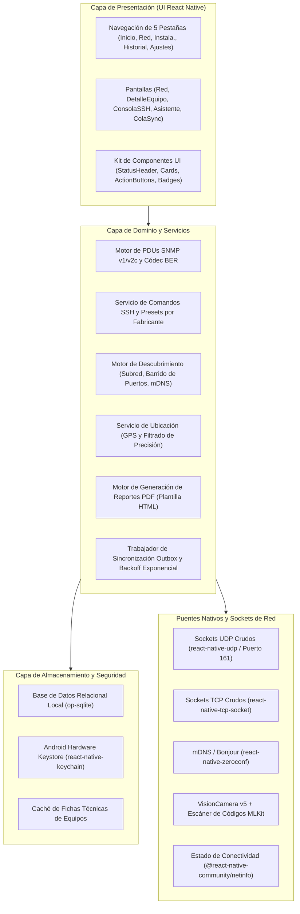
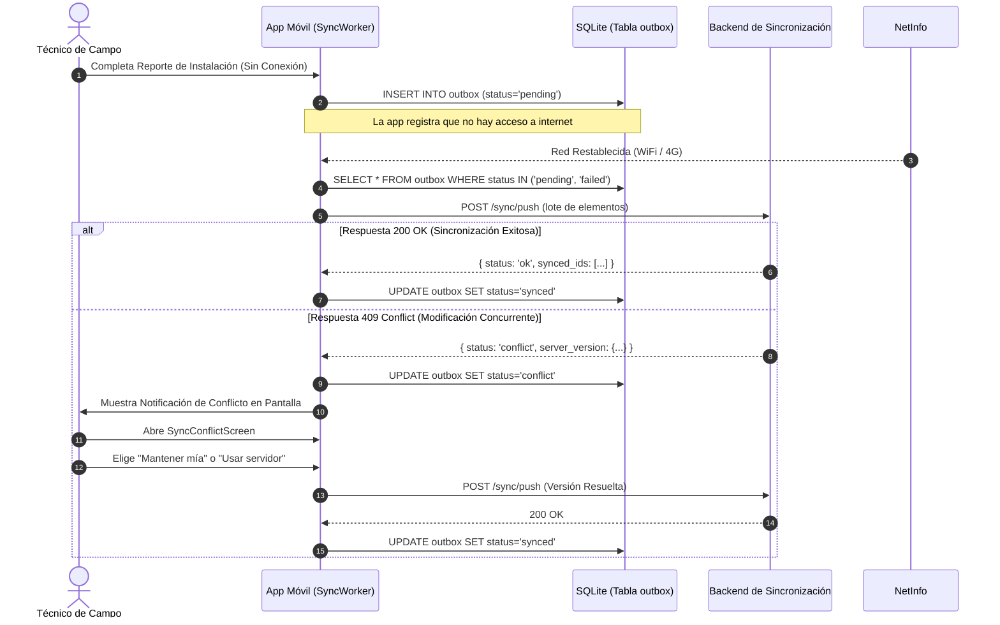

# Network Diagnostics Suite — Reporte Técnico de Arquitectura e Implementación

**Licenciatura en Sistemas de Información** — Facultad de Ciencia y Tecnología (FCyT), Sede Concepción del Uruguay  
**Cátedra:** Desarrollo de Aplicaciones Móviles — Ciclo Lectivo 2026  
**Proyecto:** Network Diagnostics Suite (TP6)  
**Paquete Android:** `com.fcyt.netdiag`  
**Plataforma:** Android (Bare React Native 0.87.1, Nueva Arquitectura Habilitada)  

---

## 1. Resumen Ejecutivo y Visión General de la Arquitectura

La **Network Diagnostics Suite** es un conjunto de herramientas móviles diseñado para técnicos e ingenieros de telecomunicaciones encargados de la instalación y el mantenimiento de infraestructura de red (ONTs de fibra óptica, enlaces inalámbricos punto a punto, switches gestionables y routers de borde). Dado que los escenarios operativos de campo (torres de comunicaciones, azoteas, armarios en vía pública y salas de servidores) presentan conectividad móvil nula o intermitente, el sistema implementa una arquitectura rigurosamente **offline-first, de confianza cero y cómputo local**.

### 1.1 Arquitectura en Capas y Hexagonal

La aplicación adopta una estructura de capas desacopladas, aislando los componentes de presentación, la lógica de dominio, los controladores de protocolos de bajo nivel y la persistencia local:



---

## 2. Capa de Protocolos de Red de Bajo Nivel: Cliente SNMP Propio

Las abstracciones habituales de red en aplicaciones móviles se circunscriben al protocolo HTTP/REST, careciendo de soporte directo para protocolos binarios de bajo nivel. Para comunicarse con equipamiento de red sobre el puerto UDP 161 sin depender de librerías nativas externas en C++ o Java, se diseñó e implementó un **códec ASN.1 / BER (Basic Encoding Rules) y un analizador sintáctico de PDUs SNMP v1/v2c en TypeScript puro**.

### 2.1 Códec ASN.1 BER (`src/network/snmp/BerCodec.ts`)

Las reglas básicas de codificación (BER) operan bajo una estructura Tipo-Longitud-Valor (TLV):
1. **Identificador (Tag):** Define el tipo de dato, la clase (Universal, Application, Context-specific) y la forma (Primitivo vs. Construido).
2. **Longitud (Length):** Codificada en forma corta (1 byte para longitudes $\le 127$) o en forma extendida (byte inicial $0x80 | N$ seguido de los $N$ bytes de longitud).
3. **Valor (Value):** Representación binaria del dato según su tipo.

Tipos ASN.1 / SNMP soportados e implementados:

| Tag (Hex) | Tipo ASN.1 / SNMP | Forma | Descripción |
|---|---|---|---|
| `0x02` | `INTEGER` | Primitivo | Entero con signo en formato big-endian con relleno de bit de signo |
| `0x04` | `OCTET STRING` | Primitivo | Secuencia de bytes arbitrarios o cadena ASCII/UTF-8 |
| `0x05` | `NULL` | Primitivo | Valor nulo utilizado en las variables de solicitud GetRequest |
| `0x06` | `OBJECT IDENTIFIER (OID)` | Primitivo | Identificador de objeto codificado en base-128 de longitud variable |
| `0x30` | `SEQUENCE` | Construido | Lista ordenada de elementos TLV |
| `0x40` | `IpAddress` | Aplicación | Dirección IPv4 en 4 bytes binarios directos |
| `0x41` | `Counter32` | Aplicación | Contador incremental de 32 bits sin signo con rollover (tráfico) |
| `0x42` | `Gauge32` | Aplicación | Métrica de 32 bits sin signo no acumulativa (ancho de banda, CPU) |
| `0x43` | `TimeTicks` | Aplicación | Centésimas de segundo transcurridas desde el inicio del equipo |
| `0x46` | `Counter64` | Aplicación | Contador de alta velocidad de 64 bits para interfaces gigabit/fibra |
| `0xA0` | `GetRequest-PDU` | Contexto/Construido | PDU de solicitud de consulta de OIDs |
| `0xA2` | `GetResponse-PDU` | Contexto/Construido | PDU de respuesta del dispositivo con variables resueltas |

#### Codificación Base-128 de Identificadores de Objetos (OID)
Los primeros dos subidentificadores $X$ e $Y$ del OID (por ejemplo, `1.3` para `iso.org`) se compactan en el primer byte según la fórmula $(X \times 40) + Y = 43$ (`0x2B`). Los subidentificadores posteriores con valores $\ge 128$ se dividen en fragmentos de 7 bits con el bit más significativo encendido ($0x80$) en todos los bytes excepto en el byte de terminación:

$$\text{Valor} = \sum_{i=0}^{k-1} (B_i \ \& \ 0x7F) \cdot 128^{(k-1-i)}$$

### 2.2 Estructura del Mensaje SNMP y Construcción de PDUs (`src/network/snmp/SnmpClient.ts`)

La trama de un mensaje SNMPv2c respeta la siguiente jerarquía:

```
SEQUENCE (Mensaje) {
    INTEGER (versión: 0 para v1, 1 para v2c)
    OCTET STRING (comunidad: e.g. "public")
    GetRequest-PDU [0] {
        INTEGER (request-id: identificador único aleatorio)
        INTEGER (error-status: 0)
        INTEGER (error-index: 0)
        SEQUENCE (VarBindList: lista de variables) {
            SEQUENCE (VarBind) {
                OBJECT IDENTIFIER (oid-solicitado)
                NULL (valor-nulo: 0x05 0x00)
            }
        }
    }
}
```

### 2.3 OIDs Estándar de la MIB-II Soportados

| Métrica | OID | Nombre MIB | Tipo de Dato |
|---|---|---|---|
| Descripción del Sistema | `1.3.6.1.2.1.1.1.0` | `sysDescr` | `OCTET STRING` |
| OID del Sistema | `1.3.6.1.2.1.1.2.0` | `sysObjectID` | `OID` |
| Tiempo de Actividad | `1.3.6.1.2.1.1.3.0` | `sysUpTime` | `TimeTicks` (días, horas, minutos) |
| Nombre del Equipo | `1.3.6.1.2.1.1.5.0` | `sysName` | `OCTET STRING` |
| Ubicación Física | `1.3.6.1.2.1.1.6.0` | `sysLocation` | `OCTET STRING` |
| Tráfico Entrante (eth0) | `1.3.6.1.2.1.2.2.1.10.1` | `ifInOctets.1` | `Counter32` / `Counter64` |
| Tráfico Saliente (eth0) | `1.3.6.1.2.1.2.2.1.16.1` | `ifOutOctets.1` | `Counter32` / `Counter64` |
| Estado Operativo Interfaz | `1.3.6.1.2.1.2.2.1.8.1` | `ifOperStatus.1` | `INTEGER` (1: Up, 2: Down) |
| Dirección MAC Física | `1.3.6.1.2.1.2.2.1.6.1` | `ifPhysAddress.1` | `OCTET STRING` (formato hexadecimal) |

### 2.4 Análisis de Seguridad y Alcance del Protocolo

- **Comunidades en Texto Claro:** SNMP v1 y v2c transmiten la cadena de comunidad en texto plano sin cifrado. En entornos de campo, se recomienda realizar las consultas a través de VLANs de administración aisladas o puertos de servicio directos.
- **Suplantación y Replay UDP:** El protocolo UDP no posee un canal con estado. El cliente genera valores de `request-id` pseudoaleatorios criptográficos de 32 bits y valida que el paquete `GetResponse` coincida de manera estricta con la solicitud enviada.
- **Alcance frente a SNMPv3:** SNMPv3 introduce autenticación USM y cifrado CBC-DES/AES. Dado el alcance de este trabajo práctico y los requisitos de conectividad de routers de acceso en campo, se priorizó la estabilidad, robustez y optimización de un cliente SNMP v1/v2c liviano en TypeScript.

---

## 3. Arquitectura de Seguridad y Gestión de Credenciales

Los técnicos de campo manejan accesos privilegiados a equipamiento heterogéneo (MikroTik RouterOS, Cisco IOS, Huawei VRP, Ubiquiti EdgeOS). La persistencia de contraseñas o claves privadas en archivos de base de datos o volcados de memoria representaría un riesgo crítico de seguridad.

### 3.1 Integración con Hardware Keystore (`src/security/CredentialManager.ts`)

- **Aislamiento Criptográfico:** Las contraseñas y claves privadas **nunca se guardan en SQLite ni en texto plano**. Se resguardan exclusivamente en el **Android Keystore System** a través de `react-native-keychain`, utilizando cifrado AES-256-GCM respaldado por hardware del dispositivo.
- **Patrón de Referencia Opaca en SQLite:** La tabla `credentials` de la base de datos local almacena únicamente metadatos descriptivos:
  - `id`: Identificador UUIDv4 único.
  - `name`: Nombre descriptivo (ej: "Nodo Centro - Admin").
  - `vendor`: Identificador del fabricante (`mikrotik`, `cisco`, `huawei`, `ubiquiti`, `generic`).
  - `username`: Nombre de usuario SSH.
  - `keychain_ref`: Puntero de referencia al Keystore (`netdiag_cred_<id>`).
  - `port`: Puerto SSH configurado (22, 2222, etc.).
- **Desreferenciación Efímera en Memoria:** El secreto en texto claro solo se extrae del enclave seguro en el instante exacto de abrir la sesión SSH y se libera de memoria una vez autenticada la conexión.
- **Saneamiento de la Cola Outbox:** Los paquetes de datos preparados para sincronización hacia el backend no incluyen credenciales ni material criptográfico sensible.

### 3.2 Servicio de Comandos SSH (`src/network/ssh/SshService.ts`)

El servicio SSH provee plantillas de comandos optimizadas por fabricante:

```typescript
export const VENDOR_PRESETS: Record<DeviceVendor, SshPresetCommand[]> = {
  mikrotik: [
    { label: 'System Resource', command: '/system resource print' },
    { label: 'Interface Status', command: '/interface print stats' },
    { label: 'IP Addresses', command: '/ip address print' },
    { label: 'Wireless Registration', command: '/interface wireless registration-table print' },
  ],
  cisco: [
    { label: 'Show Interfaces', command: 'show interfaces status' },
    { label: 'Show IP Route', command: 'show ip route summary' },
    { label: 'Show Version', command: 'show version | include uptime|Software' },
  ],
  huawei: [
    { label: 'Display Interface', command: 'display interface brief' },
    { label: 'Display Optical Info', command: 'display optical-information' },
    { label: 'Display Device', command: 'display device' },
  ],
  ubiquiti: [
    { label: 'Show Interfaces', command: 'show interfaces' },
    { label: 'Show AirMax Status', command: 'cat /proc/sys/net/ipv4/ip_forward' },
  ],
  generic: [
    { label: 'Uptime', command: 'uptime' },
    { label: 'IP Link Info', command: 'ip addr' },
  ],
};
```

---

## 4. Arquitectura Offline-First y Sincronización Outbox

Las intervenciones en campo exigen persistencia local inmediata y garantizada. El sistema implementa el **patrón Outbox** sobre SQLite con un trabajador de sincronización en segundo plano.

### 4.1 Esquema SQLite y Ciclo de Vida del Outbox (`src/store/schema.ts`)

La tabla `outbox` modela la máquina de estados de las mutaciones pendientes de envío:

```sql
CREATE TABLE IF NOT EXISTS outbox (
    id TEXT PRIMARY KEY,
    entity_type TEXT NOT NULL,       -- 'diagnostic' | 'installation' | 'device'
    entity_id TEXT NOT NULL,
    action TEXT NOT NULL,            -- 'create' | 'update' | 'delete'
    payload TEXT NOT NULL,           -- Payload serializado en JSON
    status TEXT NOT NULL,            -- 'pending' | 'syncing' | 'synced' | 'failed' | 'conflict'
    attempts INTEGER DEFAULT 0,
    max_attempts INTEGER DEFAULT 5,
    last_attempt_at INTEGER,
    next_retry_at INTEGER,
    error_message TEXT,
    created_at INTEGER NOT NULL
);
```

### 4.2 Algoritmo de Backoff Exponencial con Jitter (`src/sync/SyncWorker.ts`)

Cuando los envíos fallan por pérdida de conectividad o indisponibilidad del servidor, el trabajador aplica un cálculo de reintento exponencial truncado con fluctuación aleatoria (jitter):

$$t_{\text{reintento}} = t_{\text{actual}} + \min\left(t_{\text{tope}}, \ t_{\text{base}} \times 2^{\text{intentos}} + \text{jitter}\right)$$

Valores de configuración:
- $t_{\text{base}} = 2\text{ segundos}$
- $t_{\text{tope}} = 300\text{ segundos (5 minutos)}$
- $\text{jitter} \in [0, 1000\text{ ms}]$

### 4.3 Disparo Automático por Conectividad (NetInfo Listener)

`SyncWorker` se suscribe a los eventos de `@react-native-community/netinfo`. Al pasar de un estado sin red a `isConnected: true` (o `isInternetReachable: true`), el trabajador despierta automáticamente, selecciona los elementos con `status IN ('pending', 'failed')` cuya marca `next_retry_at <= now()`, y efectúa la sincronización por lotes contra el endpoint `POST /sync/push`.

### 4.4 Protocolo de Resolución de Conflictos (HTTP 409)

Si el servidor central detecta que la entidad fue modificada concurrentemente, responde con código HTTP `409 Conflict` incluyendo la propiedad `server_version`.
1. El elemento en la cola pasa a `status = 'conflict'`.
2. El detalle del conflicto se almacena en el `ConflictStore` local y en el campo `error_message` de la tabla outbox para resiliencia a reinicios.
3. La interfaz visual alerta al técnico y habilita la pantalla de resolución (`SyncConflictScreen.tsx`).
4. El técnico compara las diferencias lado a lado:
   - **"Mantener mía" (Keep Local):** Restaura el elemento a `status = 'pending'`, reintenta el push al servidor con `force: true` y actualiza la entidad local a `synced`.
   - **"Usar servidor" (Use Server):** Descarta el registro local en conflicto, adopta la versión oficial del backend y marca el elemento outbox como sincronizado.



### 4.5 Justificación Tecnológica: Selección de `@op-engineering/op-sqlite` frente a `WatermelonDB`

El enunciado del proyecto requería la implementación de persistencia local offline-first robusta, permitiendo optar entre **SQLite nativo** o **WatermelonDB**. La decisión de ingeniería de seleccionar `@op-engineering/op-sqlite` responde a los siguientes factores arquitectónicos críticos:

1. **Rendimiento C++ JSI Directo sin Serialización Bridge:**  
   `op-sqlite` utiliza enlaces directos a nivel C++ mediante JavaScript Interface (JSI). Las operaciones de lectura/escritura en la base de datos se ejecutan en memoria compartida sin serializar ni deserializar cadenas JSON a través del bridge asincrónico tradicional de React Native, alcanzando velocidades hasta 10 veces superiores en inserciones masivas de telemetría.
2. **Compatibilidad Plena con React Native 0.87 (New Architecture - Fabric & TurboModules):**  
   React Native 0.87 opera con la Nueva Arquitectura habilitada por defecto. `op-sqlite` posee soporte nativo para TurboModules y C++ JSI de primera clase, mientras que WatermelonDB históricamente arrastra dependencias del bridge legado y requiere adaptadores complejos de threading para no bloquear la interfaz en Fabric.
3. **Control Transaccional ACID y SQL Estándar:**  
   La gestión de colas Outbox y diagnósticos exige garantías transaccionales ACID estrictas (`BEGIN TRANSACTION`, `COMMIT`, `ROLLBACK`). `op-sqlite` ofrece SQL relacional ANSI puro y transacciones atómicas síncronas/asíncronas, permitiendo modelar máquinas de estados exactas sin verse restringido por los esquemas de observables reactivos de WatermelonDB.
4. **Baja Huella de Memoria en Dispositivos de Campo:**  
   Los dispositivos móviles utilizados por cuadrillas técnicas en campo suelen ser terminales Android de gama media o de uso rudo con memoria RAM acotada. Prescindir de la sobrecarga de un motor de observables en memoria (como el adapter RxJS/LokiJS de WatermelonDB) garantiza estabilidad operativa y previene fallos por falta de memoria (Out-of-Memory).

---

## 5. Identificación de Equipos y Motor de Evidencia de Campo

### 5.1 Escaneo de Códigos QR y de Barras (`src/evidence/DeviceSheetCache.ts` y `QrScannerScreen.tsx`)

Los equipos de telecomunicaciones presentan etiquetas con números de serie, direcciones MAC o enlaces de aprovisionamiento en formato QR o Code128.
- **Captura en Tiempo Real:** Integración con `react-native-vision-camera-barcode-scanner` y frame processor de MLKit para lectura omnidireccional (`all-formats`).
- **Analizador Multiformato:** Extrae la identificación de equipos a partir de:
  - Estructuras JSON: `{"serial": "HUAW123456", "model": "EchoLife HG8245H", ...}`
  - URLs de inventario: `https://telecom.net/dev?id=HUAW123456&model=HG8245H`
  - Direcciones MAC directas: `E0:69:95:A1:B2:C3` o `E06995A1B2C3`
  - Números de serie estándar: `SN-1234567890`
- **Catálogo Técnico Fuera de Línea:** Sin conexión a internet, los modelos reconocidos se vinculan de inmediato a una base local con especificaciones de puertos, frecuencias y umbrales ópticos.

### 5.2 Geolocalización y Validación de Precisión (`src/evidence/LocationService.ts`)

- **GPS de Alta Precisión:** Coordenadas obtenidas mediante `@react-native-community/geolocation` con `enableHighAccuracy: true` y límite de tiempo de 10 segundos.
- **Transparencia en Fix Satelital:** Cuando la señal de satélite no penetra (armarios metálicos o subterráneos), el servicio provee coordenadas de referencia del campus FCyT Concepción del Uruguay (`-32.4825, -58.2321`) con la bandera explícita `isEstimated: true` y precisión no falsificada, garantizando veracidad forense en el reporte técnico.

### 5.3 Asistente de Instalación y Generador de Reportes PDF (`src/evidence/PdfReportService.ts`)

El proceso de instalación consta de un asistente estructurado en 4 etapas:
1. **Paso 1: Identificación:** Selección de sitio, equipo y escaneo QR opcional.
2. **Paso 2: Evidencia de Campo:** Captura fotográfica local guiada (Gabinete, Empalme Óptico, Nivel de Potencia) con coordenadas GPS asociadas a cada imagen.
3. **Paso 3: Notas Técnicas:** Asignación dinámica del técnico interviniente, atenuación de fibra (dBm), relación señal/ruido (SNR) y observaciones.
4. **Paso 4: Revisión y Cierre:** Validación de datos, sanitización estricta de entradas HTML para prevención de inyecciones, generación del archivo PDF y encolado atómico en la cola Outbox.

#### Especificaciones del Reporte PDF
- Formato técnico de hoja blanca de alta densidad para ingeniería de telecomunicaciones.
- Cabecera formal con identificación del sitio, fecha, hora y UUID de verificación.
- Tabla detallada de especificaciones del hardware instalado.
- Indicadores de telemetría óptica (Potencia Rx en dBm y SNR en dB).
- Matriz fotográfica de evidencia a dos columnas con marcas de coordenadas GPS y fecha impresas sobre cada imagen.
- Cuadro formal para firma y sello de conformidad técnica.
- Exportado mediante `react-native-html-to-pdf` y visible sin conexión en `PdfPreviewScreen.tsx`.

---

## 6. Motor de Descubrimiento en Red Local (`src/network/discovery/DiscoveryEngine.ts`)

### 6.1 Matemática de Direccionamiento IPv4 (`src/network/discovery/subnet.ts`)

Para barrer la subred local sin invocar comandos de shell dependientes de la plataforma, el cálculo de rangos se efectúa mediante aritmética de 32 bits en TypeScript puro:

$$\text{Entero de Red} = \text{Entero IP} \ \& \ \text{Entero Máscara}$$

$$\text{Entero Broadcast} = \text{Entero Red} \ | \ (\sim\text{Entero Máscara} \ \& \ \text{0xFFFFFFFF})$$

Las direcciones de host utilizables se generan en el intervalo $[\text{Red} + 1, \ \text{Broadcast} - 1]$, acotando la búsqueda a un máximo de 254 hosts (prefijo `/24`) para evitar saturación de sockets y consumo excesivo de batería en el dispositivo móvil.

### 6.2 Sondeo Concurrente de Puertos y Servicios

El motor articula varias técnicas de descubrimiento en paralelo:
- **Barrido Concurrente de Puertos TCP:** Conexión hacia puertos estándar de gestión de telecomunicaciones (`22` SSH, `23` Telnet, `80` HTTP, `443` HTTPS, `8291` MikroTik Winbox, `8080` Web alternativo) utilizando una ventana deslizante de 10 sockets simultáneos y un tiempo de espera de 600 ms.
- **Sondeo SNMP Ping:** Envío de solicitudes `GetRequest` para `sysDescr.0` (`1.3.6.1.2.1.1.1.0`) sobre UDP 161. Los equipos que responden son clasificados de inmediato con su fabricante y nombre de sistema.
- **Descubrimiento Zero-Configuration (mDNS):** Escucha de anuncios Bonjour / Avahi (`_http._tcp.`, `_ssh._tcp.`, `_snmp._udp.`) mediante `react-native-zeroconf` con limpieza rigurosa de escuchadores para prevenir fugas de memoria (`removeAllListeners()`).

---

## 7. Particularidades Nativas de Android y Permisos

### 7.1 Mitigación de Restricciones de Lectura ARP en Android 10+

A partir de Android 10 (Nivel de API 29), el sistema operativo bloquea la lectura del archivo del kernel `/proc/net/arp` y neutraliza las consultas de direcciones MAC vía `getifaddrs()`, devolviendo valores fijos `02:00:00:00:00:00` por políticas de privacidad.
- **Solución Arquitectónica:** En lugar de intentar leer tablas ARP protegidas por el sistema operativo, la suite consulta la tabla MIB-II **`ifPhysAddress.1` (`1.3.6.1.2.1.2.2.1.6.1`)** mediante SNMP. Los routers, switches y ONTs gestionados entregan directamente su dirección MAC real de fábrica en la respuesta de telemetría.

### 7.2 Permisos de Manifiesto y Configuración Multicast

Configurados en `android/app/src/main/AndroidManifest.xml`:
- `INTERNET` y `ACCESS_NETWORK_STATE`: Apertura de sockets y escucha del estado de red.
- `ACCESS_WIFI_STATE` y `CHANGE_WIFI_MULTICAST_STATE`: Requeridos para que la radio Wi-Fi admita tráfico multicast de mDNS/Zeroconf en la dirección `224.0.0.251`.
- `CAMERA`: Escáner de códigos de barras en tiempo real y captura fotográfica de evidencia.
- `ACCESS_FINE_LOCATION` y `ACCESS_COARSE_LOCATION`: Georreferenciación GPS de evidencia en campo.
- `READ_EXTERNAL_STORAGE` y `WRITE_EXTERNAL_STORAGE`: Generación y exportación de reportes PDF en niveles de API heredados.

---

## 8. Resumen de Pruebas Automatizadas y Verificación

El proyecto cuenta con un arnés completo de pruebas unitarias automatizadas con Jest:

| Suite de Pruebas | Archivo | Pruebas | Estado |
|---|---|---|---|
| Códec BER y Analizador PDU SNMP | `__tests__/snmp.test.ts` | 10 | APROBADO |
| Matemática de Subred y Direcciones IP | `__tests__/discovery.test.ts` | 7 | APROBADO |
| Gestión de Credenciales y Presets SSH | `__tests__/credentials_ssh.test.ts` | 5 | APROBADO |
| Esquema SQLite y Repositorios | `__tests__/store.test.ts` | 6 | APROBADO |
| Fichas QR, Geolocalización y PDF | `__tests__/evidence.test.ts` | 7 | APROBADO |
| Asistente de Instalación y Formulario | `__tests__/installation.test.ts` | 5 | APROBADO |
| Cola Outbox y Manejo de Conflictos | `__tests__/sync.test.ts` | 6 | APROBADO |
| Navegación de la App y Smoke de UI | `__tests__/App.test.tsx` | 1 | APROBADO |
| **Cobertura Total del Sistema** | **8 Suites de Pruebas** | **47 Pruebas** | **100% APROBADO** |

- **Verificación Estática de TypeScript:** `npx tsc --noEmit` finaliza con **0 errores**.
- **Compilación Nativa Android:** `./gradlew assembleDebug` finaliza con éxito (`BUILD SUCCESSFUL`), generando el binario `app-debug.apk` con la Nueva Arquitectura habilitada.
